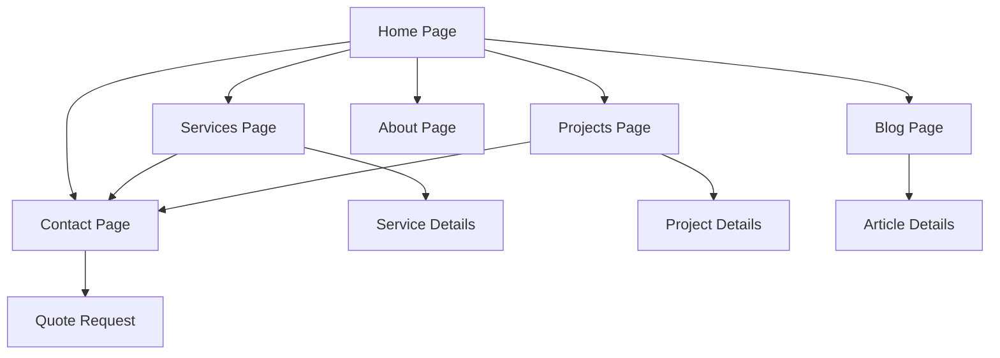

# Dewamotor Professional Website - Product Requirements Document

## 1. Product Overview
A modern, professional website for Dewamotor automotive services that replaces the existing site at https://dewamotor.com while maintaining brand identity and improving user experience.

The website serves as the primary digital presence for Dewamotor, showcasing automotive services, completed projects, and facilitating customer engagement through an intuitive, responsive design that works seamlessly across all devices.

## 2. Core Features

### 2.1 User Roles
| Role | Registration Method | Core Permissions |
|------|---------------------|------------------|
| Visitor | No registration required | Can browse services, view projects, contact business |
| Customer | Contact form submission | Can request quotes, view service details, access contact information |

### 2.2 Feature Module
Our Dewamotor website consists of the following main pages:
1. **Home page**: hero section, services overview, featured projects, testimonials, contact CTA
2. **Services page**: detailed service listings, pricing information, service process
3. **Projects page**: completed work showcase, before/after galleries, project details
4. **About page**: company information, team details, certifications, experience
5. **Contact page**: contact form, location map, business hours, contact information
6. **Blog page**: latest news, automotive tips, company updates

### 2.3 Page Details

| Page Name | Module Name | Feature description |
|-----------|-------------|---------------------|
| Home page | Hero section | Display compelling headline, call-to-action button, background automotive imagery |
| Home page | Services overview | Show 3-4 key services with icons, brief descriptions, "Learn More" links |
| Home page | Featured projects | Display recent completed work with before/after images, project highlights |
| Home page | Testimonials | Customer reviews carousel with ratings, photos, testimonial text |
| Home page | Contact CTA | Prominent contact section with phone, email, location, quote request button |
| Services page | Service listings | Comprehensive service details, pricing, duration, included features |
| Services page | Service process | Step-by-step process visualization, what to expect, timeline |
| Services page | Pricing plans | Service packages with clear pricing, features comparison, booking CTA |
| Projects page | Project gallery | Grid layout of completed projects with filtering by service type |
| Projects page | Project details | Individual project pages with detailed before/after photos, descriptions |
| About page | Company story | Business history, mission, values, certifications, experience highlights |
| About page | Team section | Key team members with photos, roles, expertise areas |
| Contact page | Contact form | Name, email, phone, service type, message fields with validation |
| Contact page | Location info | Interactive map, address, business hours, parking information |
| Blog page | Article listings | Latest automotive news, tips, company updates with search/filter |
| Blog page | Article details | Full article content with sharing options, related articles |

## 3. Core Process

**Visitor Flow:**
1. Visitor lands on homepage → Views hero section and services overview
2. Explores services page → Reviews pricing and service details
3. Checks completed projects → Views gallery and project details
4. Contacts business → Fills contact form or calls directly

**Customer Engagement Flow:**
1. Customer discovers services → Learns about offerings and process
2. Reviews past work → Builds confidence through project gallery
3. Requests quote → Submits contact form with service requirements
4. Receives follow-up → Business contacts customer for consultation

## 4. User Interface Design

### 4.1 Design Style
- **Primary colors**: Deep red (#DC2626), Dark navy (#1E293B)
- **Secondary colors**: White (#FFFFFF), Light gray (#F8FAFC), Dark gray (#64748B)
- **Button style**: Rounded corners (8px), solid red primary buttons, outlined secondary buttons
- **Font**: Modern sans-serif (Inter or similar), 16px base size, bold headings
- **Layout style**: Clean card-based design, generous white space, automotive-focused imagery
- **Icons**: Automotive-themed icons, consistent stroke width, professional appearance

### 4.2 Page Design Overview

| Page Name | Module Name | UI Elements |
|-----------|-------------|-------------|
| Home page | Hero section | Full-width background image, overlay text, prominent red CTA button, navigation bar |
| Home page | Services overview | 3-column grid layout, service icons, card-based design with hover effects |
| Home page | Featured projects | Image carousel/grid, before/after comparison, project titles, view details buttons |
| Home page | Testimonials | Customer photo, star ratings, quote text, carousel navigation dots |
| Services page | Service listings | Card layout, service icons, pricing badges, feature lists, booking buttons |
| Services page | Process steps | Numbered steps, icons, connecting lines, progress visualization |
| Projects page | Gallery | Masonry/grid layout, hover overlays, category filters, lightbox functionality |
| Contact page | Contact form | Clean form fields, validation states, red submit button, success/error messages |
| Contact page | Map section | Embedded Google Maps, location marker, business info overlay |

### 4.3 Responsiveness
Desktop-first design with mobile-adaptive breakpoints. Touch-optimized interactions for mobile devices, including larger tap targets, swipe gestures for carousels, and collapsible navigation menu for smaller screens.

