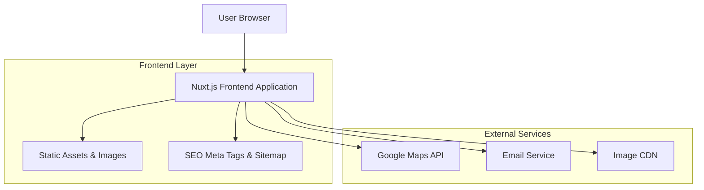
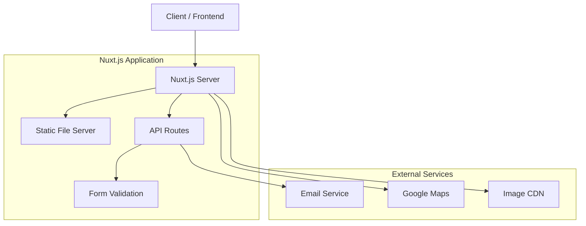
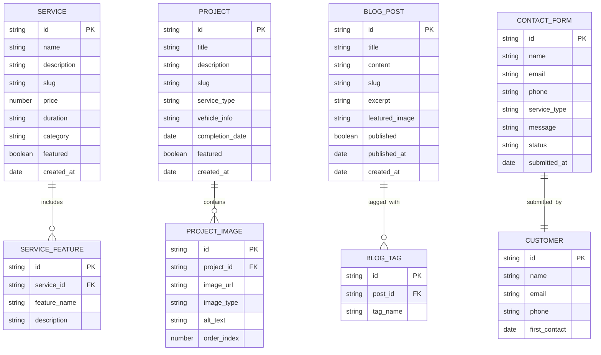

# Dewamotor Website - Technical Architecture Document

## 1. Architecture Design



## 2. Technology Description

- Frontend: Nuxt.js@4 + Vue.js@3 + TypeScript + Tailwind CSS@3 + Vite
- Deployment: Static Site Generation (SSG) for optimal performance and SEO
- External Services: Google Maps API, Email service integration

## 3. Route Definitions

| Route | Purpose |
|-------|---------|
| / | Home page with hero section, services overview, and featured projects |
| /services | Comprehensive services listing with pricing and process details |
| /services/[slug] | Individual service detail pages with specific information |
| /projects | Project gallery showcasing completed automotive work |
| /projects/[slug] | Individual project detail pages with before/after photos |
| /about | Company information, team details, and certifications |
| /contact | Contact form, location map, and business information |
| /blog | Latest news, automotive tips, and company updates |
| /blog/[slug] | Individual blog article pages with full content |

## 4. API Definitions

### 4.1 Core API

Contact form submission
```
POST /api/contact
```

Request:
| Param Name | Param Type | isRequired | Description |
|------------|------------|------------|-------------|
| name | string | true | Customer's full name |
| email | string | true | Customer's email address |
| phone | string | false | Customer's phone number |
| service | string | true | Type of service requested |
| message | string | true | Detailed message or requirements |

Response:
| Param Name | Param Type | Description |
|------------|------------|-------------|
| success | boolean | Status of form submission |
| message | string | Success or error message |

Example Request:
```json
{
  "name": "John Doe",
  "email": "john@example.com",
  "phone": "+1234567890",
  "service": "Engine Repair",
  "message": "Need engine diagnostic and repair for my 2018 Honda Civic"
}
```

Quote request API
```
POST /api/quote
```

Request:
| Param Name | Param Type | isRequired | Description |
|------------|------------|------------|-------------|
| name | string | true | Customer's full name |
| email | string | true | Customer's email address |
| phone | string | true | Customer's phone number |
| vehicle | object | true | Vehicle information (make, model, year) |
| services | array | true | List of requested services |
| description | string | false | Additional details about the work needed |

Response:
| Param Name | Param Type | Description |
|------------|------------|-------------|
| success | boolean | Status of quote request |
| quoteId | string | Unique identifier for the quote request |

## 5. Server Architecture Diagram



## 6. Data Model

### 6.1 Data Model Definition



### 6.2 Data Definition Language

Since this is a static site with Nuxt.js, data will be managed through JSON files and markdown content. Here's the content structure:

Content Structure (content/)
```
-- Services data
// content/services/engine-repair.md
// content/services/brake-service.md
// content/services/transmission-repair.md

-- Projects data  
// content/projects/honda-civic-engine-rebuild.md
// content/projects/toyota-camry-brake-replacement.md

-- Blog posts
// content/blog/winter-car-maintenance-tips.md
// content/blog/signs-your-brakes-need-replacement.md

-- Static data files
// data/testimonials.json
// data/team-members.json
// data/company-info.json
```

Example Service Content Structure:
```yaml
---
title: "Engine Repair & Diagnostics"
slug: "engine-repair"
category: "Engine Services"
price: 150
duration: "2-4 hours"
featured: true
description: "Complete engine diagnostic and repair services"
features:
  - "Computer diagnostics"
  - "Engine performance testing"
  - "Repair recommendations"
  - "Quality parts guarantee"
---

Detailed service content in markdown format...
```

Example Project Content Structure:
```yaml
---
title: "Honda Civic Engine Rebuild"
slug: "honda-civic-engine-rebuild"
service_type: "Engine Repair"
vehicle: "2018 Honda Civic"
completion_date: "2024-01-15"
featured: true
images:
  - url: "/images/projects/civic-before-1.jpg"
    type: "before"
    alt: "Honda Civic engine before repair"
  - url: "/images/projects/civic-after-1.jpg"
    type: "after"
    alt: "Honda Civic engine after rebuild"
---

Project description and details in markdown format...
```